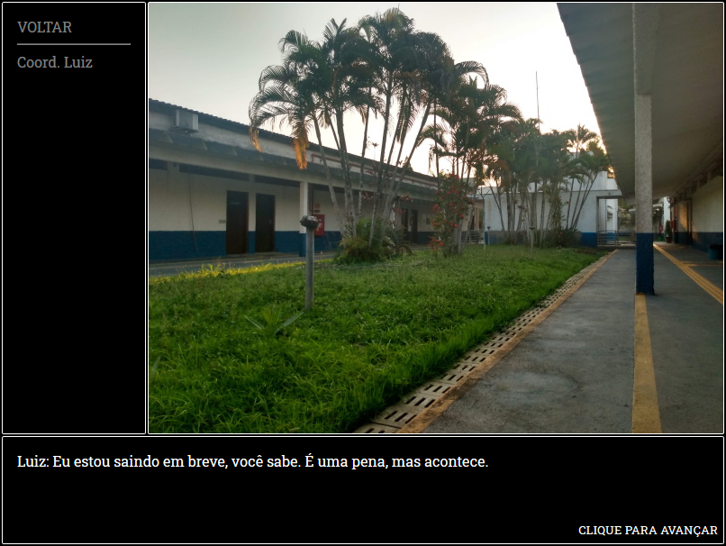
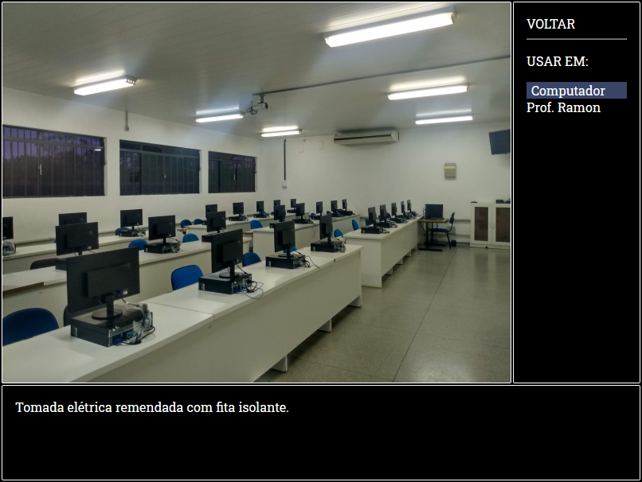

# AdventureGame.js

GUI para jogos de aventura no estilo clássico, utilizando CSS, HTML5, Javascript e JSON. 

## Descrição

Uma GUI para jogos de aventura baseada em jogos de aventura clássicos (Uninvited, Famicom Detective Club, etc), para fins educacionais, afim de estudar as tecnologias referentes a construção de aplicações web em código puro. Uso mínimo ou nulo de bibliotecas externas. (Em progresso)

## Imagens




## Utilização

Por momento, a gui apenas gera cenas estáticas, sem interação lógica. O bloco abaixo será sujeito a modificações. 

### Adicionando Cenas

- Na pasta cenas, crie um novo objeto no arquivo _cenas.json com a seguinte sintaxe.

```json
{
   "nome":"",
   "descricao":"",
   "fundo":"",
   "locais":[
      {
         "id" : "1",
         "nome":"",
         "destino":""
      }
   ],
   "pontosInteresse":[
      {
         "id" : "1",
         "nome":"",
         "descricao": [
            ""
         ]
      }
   ],
   "atores":[
      {
         "id" : "1",
         "nome":"",
         "estado":"",
         "falas":{
            "neutro":[
               ""
            ]
         }
      }
   ]
}
```

- Para acessa-lá, adicione a cena como um local em uma cena anterior

```json
"locais":[
   {
      "id" : "1",
      "nome":"Laboratório 1", // Nome Igual ao definido no objeto da cena de referência
   }
]
```

### Exemplo de Ator

```json
"atores":[
      {
         "id" : "1",
         "nome":"Coord. Luiz",
         "estado":"neutro",
         "falas":{
            "neutro":[
               "Luiz:<br>Eu estou saindo em breve, você sabe. É uma pena, mas acontece.",
               "Luiz:<br>Espero que esse lugar não acabe uma várzea enquanto eu estiver fora.",
               "Luiz:<br>Mas é provável que tudo fique bem, no fim das contas."
            ]
         }
      }
   ]
```
