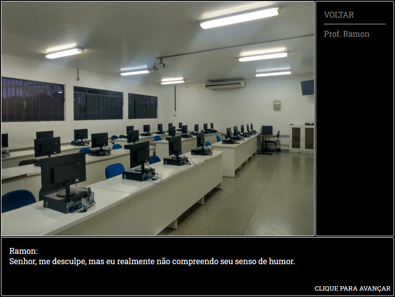

# AdventureGame.js

GUI para jogos de aventura no estilo clássico, utilizando CSS, HTML5, Javascript e JSON. 

## Descrição

Uma GUI para jogos de aventura baseada em jogos de aventura clássicos (Uninvited, Famicom Detective Club, etc), para fins educacionais, afim de estudar as tecnologias referentes a construção de aplicações web em código puro. Uso mínimo ou nulo de bibliotecas externas. (Em progresso)

## Imagens




## Utilização

Por momento, a gui apenas gera cenas estáticas, sem interação lógica. O bloco abaixo será sujeito a modificações. 

### Adicionando Cenas

- Na pasta cenas, crie um novo objeto no arquivo _cenas.json com a seguinte sintaxe.

```json
{
   "nome":"",
   "descricao":"",
   "fundo":"",
   "locais":[
      {
         "id" : "",
         "nome":""
      }
   ],
   "pontosInteresse":[
      {
         "id" : "",
         "nome":"",
         "estado": "",
         "descricoes": [
            {
               "id": "",
               "idEstado": "0",
               "itemTrigger": "nenhum",
               "descricao": [
                  "Tela preta, travada. Não adianta reiniciar, eu sei que ele não vai voltar a ligar tão cedo.",
                  "Uma pena, realmente, mas fazer o quê."
               ]
            },
            {
               "id" : "",
               "idEstado": "",
               "itemTrigger": "",
               "descricao": [
                  ""
               ]
            }
         ]
      }
   ],
   "atores":[
      {
         "id" : "",
         "nome":"",
         "estado" : "",
         "falas": [
            {
               "idEstado": "",
               "itemTrigger": "",
               "dialogo": [
                  ""
               ]
            }
         ]
      }
   ]
}
```

- Para acessa-lá, adicione a cena como um local em uma cena anterior

```json
"locais":[
   {
      "id" : "1",
      "nome":"Bloco A"
   }
]
```

### Exemplo de Ator

```json
"atores":[
           {
              "id" : "0",
              "nome":"Prof. Ramon",
              "estado" : "0",
              "falas": [
                 {
                    "idEstado": "0",
                    "itemTrigger": "nenhum",
                    "dialogo": [
                       "Ramon:<br>Olá, senhor, como anda a vida? Júquia está paradisíaca, como sempre.",
                       "Ramon:<br>Sem dúvidas, uma cidade do futuro! Oh, grã província de águas turvas!"
                    ]
                 },
                 {
                    "idEstado": "1",
                    "itemTrigger": "Fotos Enchente",
                    "dialogo": [
                       "Ramon:<br>Senhor, me desculpe, mas eu realmente não compreendo seu senso de humor.",
                       "Ramon:<br>Falsidade é um crime ainda não reconhecido pela legislação."
                    ]
                 }
              ]
           }
        ]
```

### Interação com itens

- Definir item no inventario

```json
{
   "id": "0",
   "nome": "Fotos Enchente",
   "descricao": "Fotos da enchente de Júquia, manipuladas pela imprensa."
}
```

- Definir referência a nome de item em estados do objeto

Ator:

```json
{
   "falas": [
      {
         "idEstado": "1",
         "itemTrigger": "Fotos Enchente",
         "dialogo": [
            "Ramon:<br>Senhor, me desculpe, mas eu realmente não compreendo seu senso de humor.",
            "Ramon:<br>Sorte sua que falsidade é um crime ainda não reconhecido pela legislação."
         ]
      }
   ]
}
```

Ponto de Interesse:

```json
"descricoes": [
      {
         "idEstado": "1",
         "itemTrigger": "Tomada",
         "descricao": [
            "Adivinhe só, a tomada estava partida. Agora está ligado."
         ]
      }
   ]
```
