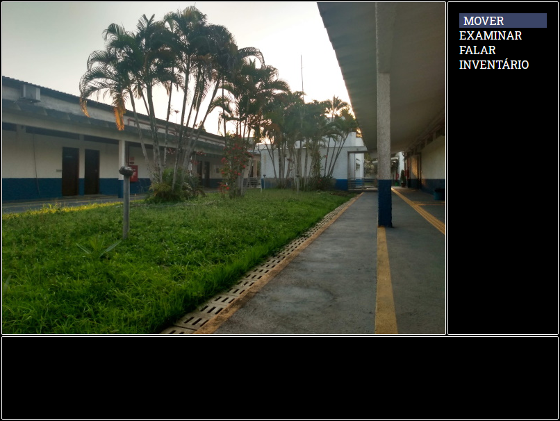

# AdventureGame.js
GUI para jogos de aventura no estilo clássico, utilizando CSS, HTML5, Javascript e JSON. 

## Descrição
Uma GUI para jogos de aventura baseada em jogos de aventura clássicos (Uninvited, Famicom Detective Club, etc), para fins educacionais, afim de estudar as tecnologias referentes a construção de aplicações web em código puro. Uso mínimo ou nulo de bibliotecas externas. (Em progresso)

## Imagens



## Utilização 
Por momento, a gui apenas gera cenas estáticas, sem interação lógica. O bloco abaixo será sujeito a modificações. 
### Adicionando Cenas
- Na pasta cenas, crie um arquivo JSON com o nome da cena que deseja criar, utilizando o seguinte formato.

```json
[
    {
       "nome":"",
       "descricao":"",
       "fundo":"",
       "locais":[
          {
             "nome":"",
             "destino":""
          }
       ],
       "pontosInteresse":[
          {
             "nome":"",
             "descricao": [
                "",
                ""
             ]
          }
       ],
       "atores":[
          {
             "estado":"",
             "nome":"",
             "falas":{
                "neutro":[
                   ""
                ]
             }
          }
       ]
    }
 ]
```

- Para acessa-lá, adicione a cena como um local em uma cena anterior
```json
[
    {
        "locais": [
            {
                "nome": "Cena1",
                "destino": "cena1.json"
            }
        ]   
    }
] 
```
### Exemplo de Ator
```json
"atores":[
      {
         "estado":"luizNeutro",
         "nome":"Coord. Luiz",
         "falas":{
            "neutro":[
               "Luiz: Eu estou saindo em breve, você sabe. É uma pena, mas acontece.",
               "Luiz: Espero que esse lugar não acabe uma várzea enquanto eu estiver fora.",
               "Luiz: Mas é provável que tudo fique bem, no fim das contas."
            ]
         }
      }
   ]
```